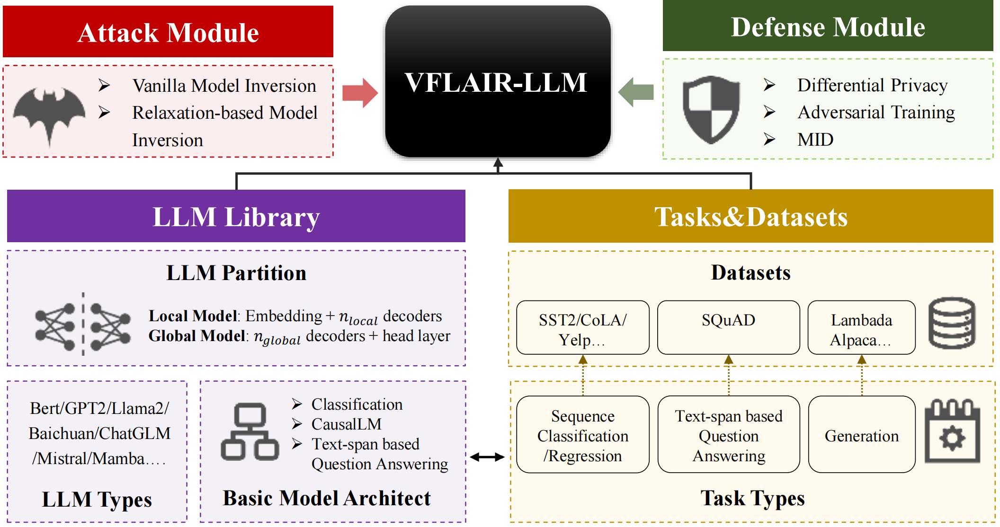

# README_LLM

[TOC]


## Introduction

In VFLAIR, we also provide a **VFL pipeline for LLM** implementation and evaluation as **a variant** of our traditional Federated Learning procedure. Here we provide the following functions: 

 

- **Model Split for LLM**: Defaultly we split the LLM between the first and second layer(encoder or decoder), which can be user-defined through config files.
  - Local Model: Embedding Layer + $n_local$ encoder/decoders
  - Global Model: the rest $n_{global}$ encoder/decoders + Head Layers for down-stream tasks
  - For detailed implementation of LLM model split, please refer to [Detailed Tutorial] section for further guidance.
- **Three Model Architect and corresponding task type**: Currently VFLAIR supported the following model architect. Each model architect can be used in its corresponding downstream tasks and datasets.
  - **CLS models** output probability vectors for the classification, which is used in normal Classification tasks. When the number of classes is reduced to 1, the model only output a single value which can be used in Regression tasks.
  - **TQA model**s output the starting and ending positions of the answer texts, which can be used in Text-span based Question Answering datasets like SQuAD. (Note that different from Generation-based QA tasks, TQA provides a piece of text for the model to find the answer in while GQA is a proper generation task)
  - **CLM models** output a word vector representing the probability of each token in the next position, which can be used in Next Token Prediction tasks like Lambada. When the model is called recursively to continuously generate the next word, the model can be used for a wider range of generative tasks like Text Generation/Code Generation/Math Problem Solving etc.

| Model Architect                             | Corresponding Transformer Class                              | Task Type                                                    | Dataset                                          |
| ------------------------------------------- | ------------------------------------------------------------ | ------------------------------------------------------------ | ------------------------------------------------ |
| CLS<br>(Classification)                     | XXXforSequenceClassification<br>e.g. transformer.BertforSequenceClassification | Sequence Classification<br>Regression                        | GLUE Benchmark                                   |
| TQA<br>(Text-span based Question Answering) | XXXforQuestionAnswering<br/>e.g. transformer.BertforQuestionAnswering | Text-span based Question Answering                           | SQuAD                                            |
| CLM<br>(Causal LM - generation)             | XXXforCausalLM<br/>e.g. transformer.GPTLMhead                | Next Token Prediction<br>Text Generation<br>Code Generation<br>Math Problem Answering | MMLU/Lambada<br>Alpaca/CodeAlpaca/<br>MATH/GMS8K |

- **Multiple Model Base**: The following LLMs are supported in VFLAIR.

| **Structure type** |                      **Supported LLMs**                      |
| :----------------: | :----------------------------------------------------------: |
|  **Encoder-only**  |                        Bert   Roberta                        |
|  **Decoder-only**  | GPT2  Llama   Baichuan   Gemma  Falcon  Mamba   ChatGLM   XLnet   Mistral |

- **Two Pipelines: Finetune&Pretrained** : Currently we support the following pipelines for LLM usage
  - Inference with pretrained LLM: In this pipeline, user can load their own/third-party pretrained LLMs into the framework and do direct inference on the test dataset.
  - LLM finetune: In this pipeline, user can finetune their own LLM on a pretrained or raw LLM on a downstream dataset


## Structure

 

- **Config Module**

  - refer to `./src/config/Readme_LLM.md` for detailed guidance about configuration file format.

- **Load Module**

  - **Load Party** - `./src/party/llm_party`

    Based on the original class 'Party', we rewrite it as Party_LLM() to cater the need of LLM finetuning&inference.

    - **Load Dataset** - `./src/dataset/party_dataset`
      - Generate input(text) into input_ids/attention_mask and token_type_ids with tokenizer
    - **Load Model** - `./src/models/llm_model`
      - In this file , we rewrite the model classes from transformer to implement model split for LLMs. Defaultly we split the model between the 1st and 2ed layer(encoder or decoder), which can be user-defined through config files.

- **Train & Evaluate Module**

  - **Training Pipelines** - `./src/evaluate/MainTaskVFL_LLM`
    - Provide Class MainTaskVFL_LLM() to finetune your own LLM or evaluate a pretrained LLM.
      - LoRA algorithm is also provided for fine-tuning
  - **Attack&Defense**: 
    - Attacks：
      - VanillaModelInversion - WhiteBox([paper]([Model Inversion Attacks that Exploit Confidence Information and Basic Countermeasures | Proceedings of the 22nd ACM SIGSAC Conference on Computer and Communications Security](https://dl.acm.org/doi/10.1145/2810103.2813677))) 
      - WhiteBoxInversion([paper]([2004.00053\] Information Leakage in Embedding Models (arxiv.org)](https://arxiv.org/abs/2004.00053)))
    - Defense：
      - Laplace Differential Privacy([paper]([Privacy Risks of General-Purpose Language Models | IEEE Conference Publication | IEEE Xplore](https://ieeexplore.ieee.org/document/9152761))) 
      - Adversarial Training - Privacy Preserving Mapping([paper]([Privacy Risks of General-Purpose Language Models | IEEE Conference Publication | IEEE Xplore](https://ieeexplore.ieee.org/document/9152761))) 
  - **Communication**: currently we only provide FedSGD for VFL_LLM communication.

- **Metrics Module**: we provide the following metris for each task type

  - Classification: accuracy 
  - Regression: mse / pearson corr 
  - Text Generation: bleu score
  - Math Problem Answering: accuracy score


## A Quick Start

1. Download your LLM model file into `././LLM_Models/`

- Your can define your model file in the config files

2. Write your configuration file as instructed in `./src/config/Readme_LLM.md` 

3. Launch your task with:

```
python main_pipeline_llm.py --configs Your_Config_File
```


## Detailed Tutorial

### How to write a configuration file for VFL_LLM?

In VFLAIR-LLM, we provide some basic prompt generation methods. Also, user can easily implement self-defined promptin

#### Basic Parameters

```json
"epochs": 100,
"lr": 0.0005,
"k": 2,
"batch_size": 1,
"pipeline": "finetune",
```

- "pipeline": finetune/pretrained
  - whether the pipeline is to finetune a base model/another pretrained model checkpoint or using a pretrained model directly for inference

#### Tokenizer

```json
"tokenizer":{
        "padding": "max_length",
        "padding_type": "outside",
        "pad_token": "[PAD]",
        "truncation": "longest_first",
        "max_length": 30,
        "padding_side": "left",
        "add_special_tokens": 1
}
```

- "padding": padding method 
  - do_not_pad / max_length / longest
- “pad_token”: the token used for padding, usually [PAD]
- "padding_type": add [PAD] inside special tokens like [CLS] [SEP] or outside them
- "max_length": max padding length
- "add_special_tokens": whether to add special tokens like [CLS] [SEP]

#### Communication Protocol

> Currently only FedSGD is supported for VFLAIR-LLM

```json
"communication":{
    "communication_protocol": "FedSGD",
    "iteration_per_aggregation": 1
}
```

### Fine-tune Strategy

```json
"finetune_configs":{
        "name":"Vanilla",
        "configs":{}
  }

"finetune_configs":{
        "name":"LoRA",
        "configs":{
            "r":4,  
            "lora_alpha":32, 
            "lora_dropout":0.1
        }
  }
```

- "name": 'Vanilla'&'LoRA'
  - name of your finetuning strategy. Currently we provide 2 strategy of 'Vanilla' and 'LoRA'. The LoRA algorithm is implemented with the PEFT([code base]([Mangrulkar, S., Gugger, S., Debut, L., Belkada, Y., Paul, S., & Bossan, B. (2022). *PEFT: State-of-the-art Parameter-Efficient Fine-Tuning methods*. https://github.com/huggingface/peft. https://github.com/huggingface/peft)) framework for easy usasge.
- "configs": detailed configuration for LoRA algorithms, name of the parameters is the same as in PEFT framwork.

#### Dataset

```json
"dataset":{
    "dataset_name": "SQuAD",
    "num_classes": 1,
    "n_shot": 1
}
```

- "dataset": the dataset for experiments
  - "dataset_name": name of the dataset
  - "num_classes": number of classes for experiments
  - "n_shot": Prompt generation method can be user-defined through this parameter. n_shot represents the number of shots needed for prompt generation
    - e.g n_shot=0[zero-shot]  n_shot=1[one-shot]

#### Model Parameters

> Currently only FedSGD is supported for VFLAIR-LLM

```json
"model_list":{
    "0": {
            "type": "textattackbert-base-uncased-SST-2",
            "pretrained": 1,
            "encoder_trainable": 1,
            "embedding_trainable": 1,
            "encoder_trainable_ids":[0],
            "output_dim": 2,
            "model_type": "Bert",
            "max_sequence": 512,
            "path": ""
        },
        "1": {
            "type": "textattackbert-base-uncased-SST-2",
            "pretrained": 1,
            "head_layer_trainable": 1,
            "encoder_trainable": 0,
            "encoder_trainable_ids":[],
            "output_dim": 2,
            "model_type": "Bert",
            "max_sequence": 512,
            "path": ""
        },
    "task":{
            "task_type": "SequenceClassification"
        }
```

- "model":
  - "pretrained": represents model loading method
    - define whether the model is loaded from a pretrained third-party model with full trained head layer(pretrained = 1) or a base model with randomly-initialized head layer.
  - "head_layer_trainable": define whether we shall freeze the head layer paramaters or leave it open for finetuning
  - "max_sequence": max length of input acceptable for the model.
    - normally we set 512 for Bert / 1024 for GPT2
- "task": Definition of task type
  - "task_type": name of the task type(QuestionAnswering/SequenceClassification...)
  - "metric_type"/"n_best_size": specific for QuestionAnswering tasks. it represents the type of metric calculation for QA(text-span) tasks
  - “doc_stride”/“max_seq_length”...: specific for QuestionAnswering tasks. it defines the max length of QA input

#### Attack

```json
"attack_list": {
        "0":{
            "name": "VanillaModelInversion_WhiteBox",
            "parameters": {
                "party": [1],
                "lr": 0.01,
                "epochs": 100,
                "batch_size": 32
            }
        }
}
```

- "name": the name for the attack
- "party": attacker party id, currently we only support 1

#### Defense

```json
"defense": {
        "name": "AdversarialTraining",
        "parameters": {
            "party": [0],
            "adversarial_model": "Mapping_MLP3",
            "adversarial_model_lr": 0.05,
            "imagined_adversary": "ImaginedAdversary_MLP3",
            "imagined_adversary_lr": 0.05,
            "lambda": 0.5,
            "seq_length": 30,
            "embed_dim": 768
        }
}
```

- "lambda": a hyper-parameter for trade-off between privacy and accuracy in adversarial loss function
- "adversarial_model": adversarial model used by the defense party
- "imagined_adversary": imagined adversary used by the defense party


### How to import New LLM models?

All models on huggingface can be directly loaded into VFLAIR as we support the same `.from_pretain(YOUR_MODEL)` API in the framework.

Note that you should identify the type of model pretrained (e.g. CausalLM...) in configuration file first. Models that can be imported with the following API can be used in VFLAIR:

- AutoModel.from_pretrained()
- AutoModelorCausalLM.from_pretrained()
- AutoModelorSequenceClassification.from_pretrained()
- AutoModelforQuestionAnswering.from_pretrained()

1. Download your model in to `../Your_Model_Path/Your_Model_Name`
2. Add your model path and name pair into `.src/load/Load_Model.py`
3. Write a proper configuration file according to tutorial
4. Launch your task with:

```
python main_pipeline_llm.py --configs Your_Config_File
```


## Other Details

### Prompt Generation

In VFLAIR-LLM, we provide some basic prompt generation methods. Also, user can easily implement self-defined prompting techniques based on our tutorials.

- **Zero-shot& Few-shots**: Number of  shots used can be alter through the config parameter *n-shot* in configuration files .
- **User-defined Prompting Method**: In `./src/load/Load_Dataset.py`, we provide function `load_dataset_per_party_llm()` for dataset loading and promp generation. Users can easily alter the prompting method here.
