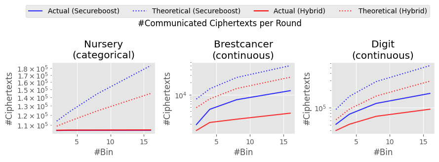

# README for Tree-based Vertical Federated Learning

We provide support for Tree-based Vertical Federated Learning (T-VFL), implementing a T-VFL framework similar to XGBoost, as described in [Kewei et al. (2019)](https://arxiv.org/pdf/1901.08755.pdf). We have also made a few modifications to it and additionally support RandomForest.

## How to write a configuration file

### 1. Basic Parameters

- "tree\_type": type of a model. `xgboost` or `randomforest`
- "number\_of\_trees": number of trees (boosting rounds).
- "depth": maximum depth.
- "min\_leaf": minimum number of samples on a leaf.
- "subsample\_cols": subsample ratio of the features.
- "max\_bin": maximum number of discrete bins to group features into buckets.
- "use\_missing\_value": if true, consider missing values (only for xgboost).
- "k": number of trees.
- "use\_encryption": if true, use paillier encryption.
- "key\_length": key length of paillier encryption.

### 2. Defense

- LP-MST ([Deep Learning with Label Differential Privacy](https://arxiv.org/abs/2102.06062))

```json
 "defense": {
    "name": "lp-mst",
    "parameters": {"lpmst_eps": 0.3}
 }
```

- Grafting-LDP ([Eliminating Label Leakage in Tree-Based Vertical Federated Learning](https://arxiv.org/abs/2307.10318))

> Grafting-LDP is implemented on the top of LP-MST.

```json
 "defense": {
    "name": "grafting-ldp",
    "parameters": {"lpmst_eps": 0.3}
 }
```

- ID-LMID ([Eliminating Label Leakage in Tree-Based Vertical Federated Learning](https://arxiv.org/abs/2307.10318))

```json
 "defense": {
    "name": "id-lmid",
    "parameters": {"mi_bound": 0.1}
 }
```

### 3. Communication Efficiency

- "is_hybrid": if true, use [HybridTree](https://arxiv.org/pdf/2310.11865.pdf) for communication-efficient training. This flag is currently applicable only for XGBoost/Secureboost.

HybridTree is a method to reduce the amount of communication during T-VFL training. If we use HybridTree, the passive parties join in the training only for leaves (the deepest nodes).

We tested HybridTree with VFAIR and observed the following.

- Only using passive parties in the training of the deepest depth shortens the training time (EXCEPT times needed for encrypting gradients/hessian and communication delay) by about 50%. It is reasonable since the number of nodes at the deepest depth is about 50% of the entire number of nodes.
  
- The loss of accuracy is around 0.03, which is compatible with the result of the original paper.

Roughly speaking, the number of communicated ciphertexts for split finding is about $F_p \cdot B \cdot 2^d$, where $F_p$ is the number of features of the passive party, $B$ is the bin size for histogram, and $d$ is the depth. Passive parties must still join the training with about 50% of nodes (about $2^{d-1}$). In addition, the active party still sends the encrypted gradients and hessian (about $2N$). Thus, HybridTree is more effective when the bin size or depth is large enough compared to the dataset size. 

The bellow figure validates the above. This figure visualizes the relationship between the maximum bin size and the communicated ciphertexts on various datasets during the training of Secureboost with/without HybridTree. The theoretical values are computed with the functions below. Since most features of the `Nursery` dataset are categorical and one-hot-encoded, the bin size is constant, and the numbers of communicated ciphertexts with/without HybridTree are almost identical. On the other hand, since the other two datasets consist of continuous features, applying HybridTree reduces the number of communicated ciphertexts more as the maximum bin size increases. 



```python
def hyp_num_basic(N, num_features, class_num,
                  sample_ratio, tree_num, depth, max_bin):
    per_tree = N * 2 * class_num * tree_num
    per_node = num_features * sample_ratio * (2**depth - 1) * 2 * max_bin * class_num * tree_num
    return per_tree + per_node

def hyp_num_hybrid(N, num_features, class_num,
                   sample_ratio, tree_num, depth, max_bin):
    per_tree = N * 2 * class_num * tree_num
    per_node = num_features * sample_ratio * (2**(depth - 1)) * 2 * max_bin * class_num * tree_num
    return per_tree + per_node
```
