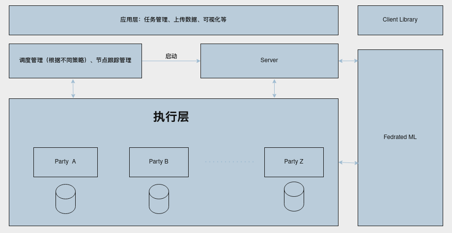
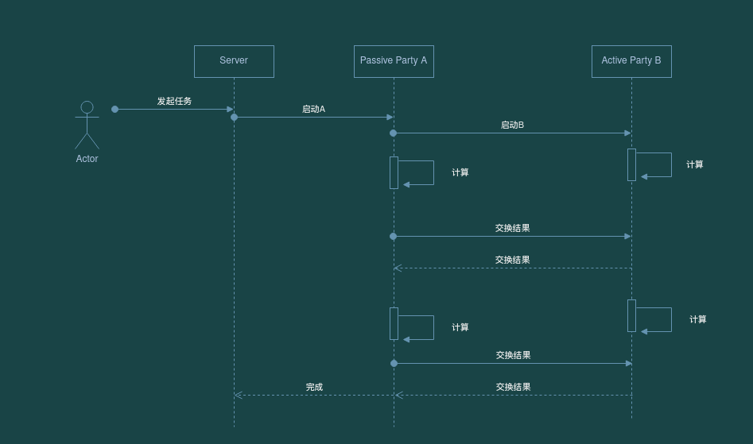

# Architecture

## Introduction

The distributed system is divided into three layers and two modules.

* The upper layer is the application layer, which is responsible for initiating training or inference tasks, viewing task results, and data visualization;
* The middle layer is the coordination layer, which is responsible for starting tasks according to different scheduling strategies and coordinating Active Party and Passive Party to complete task processing;
* The bottom layer is the computing layer (execution layer), which is responsible for specific algorithm execution and distributed communication;

The two modules refer to the federated learning algorithm module and the python client lib library, which makes it convenient for users to directly use python to execute tasks.

## Architecture Graph

## Sequence Graph

