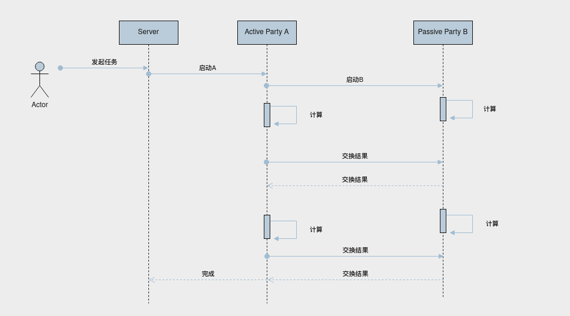

# 架构

## 介绍

分布式下系统分三层及两大模块。

* 上层是应用层，负责发起训练或推理任务、查看任务结果以及数据可视化等功能；
* 中间层是协调层，负责根据不同调度策略，启动任务，协调Active Party及Passive Party完成任务处理；
* 底层是计算层（执行层），负责具体算法执行和分布式通信；

两模块是指联邦学习算法模块及python 客户端lib库，方便用户直接使用python执行任务。

## 架构图

## 流程图

