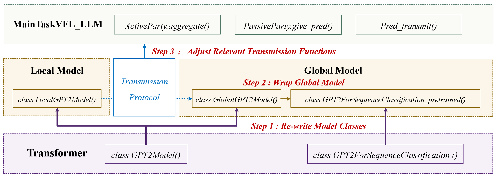

# How to add model split for your a new type of  LLM in VFLAIR-LLM?

[TOC]

Currently we provide model split for 3 types of LLM in VFLAIR: 

- Bert(Roberta/Albert),
- GPT2
- Llama. 

All model split is implemented based on the original code of transformer model classes.

We provide the following tutorial to help users implement model split based on transformer classes if they need to use other types of LLM. Here we use model split for GPT2 as an example.


## Model Split Pipeline




## Detailed Description

#### Step 1 : Re-write Model Classes

> Re-write `class GPT2Model` into `class GlobalGPT2Model` and `class LocalGPT2Model` by altering the **\_\_init\_\_()** and **forward()** function.

- **LocalGPT2Model** receives the embedding layer(self.wte/self.wpe) and the 1st encoder(self.h) from full_gpt (a normal complete GPT2 model) in \_\_init\_\_(). Then in forward() function, it conducts the embedding calculation and circulate through its  local encoders, giving out intermediate results to downstream global model.

```python
class LocalGPT2Model(GPT2PreTrainedModel):
    def __init__(self, full_gpt, num_encoders, model_type, generation_config=None):
        super().__init__(full_gpt.config)
        self.config = full_gpt.config
        self.generation_config = generation_config

        self.embed_dim = full_gpt.config.hidden_size

        self.wte = full_gpt.wte #nn.Embedding(config.vocab_size, self.embed_dim)
        self.wpe = full_gpt.wpe #nn.Embedding(config.max_position_embeddings, self.embed_dim)

        self.drop = full_gpt.drop #nn.Dropout(config.embd_pdrop)

        self.num_encoders = num_encoders # local model hidden layers
        self.num_encoders_all = full_gpt.config.num_hidden_layers # all hidden layers num
        
        self.h =  nn.ModuleList([copy.deepcopy(full_gpt.h[i]) for i in range(self.num_encoders)])

        # Model parallel
        self.model_parallel = False
        self.device_map = None
        self.gradient_checkpointing = False

        # Initialize weights and apply final processing
        self.post_init()

        # self.encoder_hidden_states=None
        # self.encoder_attention_mask=None

    def forward(
        self,
        input_ids: Optional[torch.LongTensor] = None,
        past_key_values: Optional[Tuple[Tuple[torch.Tensor]]] = None,
        attention_mask: Optional[torch.FloatTensor] = None,
        token_type_ids: Optional[torch.LongTensor] = None,
        position_ids: Optional[torch.LongTensor] = None,
        head_mask: Optional[torch.FloatTensor] = None,
        inputs_embeds: Optional[torch.FloatTensor] = None,
        encoder_hidden_states: Optional[torch.Tensor] = None,
        encoder_attention_mask: Optional[torch.FloatTensor] = None,
        use_cache: Optional[bool] = None,
        output_attentions: Optional[bool] = None,
        output_hidden_states: Optional[bool] = None,
        return_dict: Optional[bool] = None,
        
        embedding_output = None
    ) -> Union[Tuple, BaseModelOutputWithPastAndCrossAttentions]:
        #######################
        if input_ids is not None:
            batch_size, sequence_length = input_ids.shape[:2]
        else:
            batch_size, sequence_length = inputs_embeds.shape[:2]

        assert (
            self.config.pad_token_id is not None or batch_size == 1
        ), "Cannot handle batch sizes > 1 if no padding token is defined."

        
        # sequence_lengths: length of the actual text(no padding)
        if self.config.pad_token_id is None:
            sequence_lengths = -1
        else:
            if input_ids is not None:
                # print('self.config.pad_token_id:',self.config.pad_token_id)
                # print('input_ids:',input_ids)
                # print(torch.eq(input_ids, self.config.pad_token_id).long())
                # print(torch.eq(input_ids, self.config.pad_token_id).long().argmax(-1))
                sequence_lengths = (torch.eq(input_ids, self.config.pad_token_id).long().argmax(-1) - 1)
                # print(sequence_lengths)
            else:
                sequence_lengths = -1
                logger.warning(
                    f"{self.__class__.__name__} will not detect padding tokens in `inputs_embeds`. Results may be "
                    "unexpected if using padding tokens in conjunction with `inputs_embeds.`"
                )
        #####################

        output_attentions = output_attentions if output_attentions is not None else self.config.output_attentions
        output_hidden_states = (
            output_hidden_states if output_hidden_states is not None else self.config.output_hidden_states
        )
        use_cache = use_cache if use_cache is not None else self.config.use_cache
        return_dict = return_dict if return_dict is not None else self.config.use_return_dict

        if input_ids is not None and inputs_embeds is not None:
            raise ValueError("You cannot specify both input_ids and inputs_embeds at the same time")
        elif input_ids is not None:
            self.warn_if_padding_and_no_attention_mask(input_ids, attention_mask)
            input_shape = input_ids.size()
            input_ids = input_ids.view(-1, input_shape[-1])
            batch_size = input_ids.shape[0]
        elif inputs_embeds is not None:
            input_shape = inputs_embeds.size()[:-1]
            batch_size = inputs_embeds.shape[0]
        else:
            raise ValueError("You have to specify either input_ids or inputs_embeds")

        device = input_ids.device if input_ids is not None else inputs_embeds.device

        if token_type_ids is not None:
            token_type_ids = token_type_ids.view(-1, input_shape[-1])

        if past_key_values is None:
            past_length = 0
            past_key_values = tuple([None] * len(self.h))
            # past_key_values = tuple([None] * self.num_encoders_all)
        else:
            past_length = past_key_values[0][0].size(-2)
        if position_ids is None:
            position_ids = torch.arange(past_length, input_shape[-1] + past_length, dtype=torch.long, device=device)
            position_ids = position_ids.unsqueeze(0)

        # GPT2Attention mask.
        if attention_mask is not None:
            if batch_size <= 0:
                raise ValueError("batch_size has to be defined and > 0")
            attention_mask = attention_mask.view(batch_size, -1)
            # We create a 3D attention mask from a 2D tensor mask.
            # Sizes are [batch_size, 1, 1, to_seq_length]
            # So we can broadcast to [batch_size, num_heads, from_seq_length, to_seq_length]
            # this attention mask is more simple than the triangular masking of causal attention
            # used in OpenAI GPT, we just need to prepare the broadcast dimension here.
            attention_mask = attention_mask[:, None, None, :]

            # Since attention_mask is 1.0 for positions we want to attend and 0.0 for
            # masked positions, this operation will create a tensor which is 0.0 for
            # positions we want to attend and the dtype's smallest value for masked positions.
            # Since we are adding it to the raw scores before the softmax, this is
            # effectively the same as removing these entirely.
            attention_mask = attention_mask.to(dtype=self.dtype)  # fp16 compatibility
            attention_mask = (1.0 - attention_mask) * torch.finfo(self.dtype).min
        

        # If a 2D or 3D attention mask is provided for the cross-attention
        # we need to make broadcastable to [batch_size, num_heads, seq_length, seq_length]
        if self.config.add_cross_attention and encoder_hidden_states is not None:
            encoder_batch_size, encoder_sequence_length, _ = encoder_hidden_states.size()
            encoder_hidden_shape = (encoder_batch_size, encoder_sequence_length)
            if encoder_attention_mask is None:
                encoder_attention_mask = torch.ones(encoder_hidden_shape, device=device)
            encoder_attention_mask = self.invert_attention_mask(encoder_attention_mask)
        else:
            encoder_attention_mask = None

        # Prepare head mask if needed
        # 1.0 in head_mask indicate we keep the head
        # attention_probs has shape bsz x n_heads x N x N
        # head_mask has shape n_layer x batch x n_heads x N x N
        head_mask = self.get_head_mask(head_mask, self.config.n_layer)

        if inputs_embeds is None:
            inputs_embeds = self.wte(input_ids)

        # if position_ids.max() > self.config.max_position_embeddings-1:
        #     print(self.config.max_position_embeddings)
        #     print("input_ids.size():",input_ids.size())
        #     print("position_ids:",position_ids.max(),position_ids.min())
        #     assert 1>2
        # position_ids = torch.clamp(position_ids, min=0, max=self.config.max_position_embeddings-1) 
        position_embeds = self.wpe(position_ids)

        hidden_states = inputs_embeds + position_embeds

        if token_type_ids is not None:
            token_type_embeds = self.wte(token_type_ids)
            hidden_states = hidden_states + token_type_embeds

        hidden_states = self.drop(hidden_states)

        output_shape = (-1,) + input_shape[1:] + (hidden_states.size(-1),)

        if self.gradient_checkpointing and self.training:
            if use_cache:
                logger.warning_once(
                    "`use_cache=True` is incompatible with gradient checkpointing. Setting `use_cache=False`..."
                )
                use_cache = False


        presents = () if use_cache else None
        all_self_attentions = () if output_attentions else None
        all_cross_attentions = () if output_attentions and self.config.add_cross_attention else None
        all_hidden_states = () if output_hidden_states else None
        
        for i, (block, layer_past) in enumerate(zip(self.h, past_key_values)): #[:self.num_encoders]
            # Model parallel
            if self.model_parallel:
                torch.cuda.set_device(hidden_states.device)
                # Ensure layer_past is on same device as hidden_states (might not be correct)
                if layer_past is not None:
                    layer_past = tuple(past_state.to(hidden_states.device) for past_state in layer_past)
                # Ensure that attention_mask is always on the same device as hidden_states
                if attention_mask is not None:
                    attention_mask = attention_mask.to(hidden_states.device)
                if isinstance(head_mask, torch.Tensor):
                    head_mask = head_mask.to(hidden_states.device)
            if output_hidden_states:
                all_hidden_states = all_hidden_states + (hidden_states,)

            if self.gradient_checkpointing and self.training:

                def create_custom_forward(module):
                    def custom_forward(*inputs):
                        # None for past_key_value
                        return module(*inputs, use_cache, output_attentions)

                    return custom_forward

                outputs = torch.utils.checkpoint.checkpoint(
                    create_custom_forward(block),
                    hidden_states,
                    None,
                    attention_mask,
                    head_mask[i],
                    encoder_hidden_states,
                    encoder_attention_mask,
                )
            else:
                outputs = block(
                    hidden_states,
                    layer_past=layer_past,
                    attention_mask=attention_mask,
                    head_mask=head_mask[i],
                    encoder_hidden_states=encoder_hidden_states,
                    encoder_attention_mask=encoder_attention_mask,
                    use_cache=use_cache,
                    output_attentions=output_attentions,
                )

            hidden_states = outputs[0]

            if use_cache is True:
                presents = presents + (outputs[1],)

            if output_attentions:
                all_self_attentions = all_self_attentions + (outputs[2 if use_cache else 1],)
                if self.config.add_cross_attention:
                    all_cross_attentions = all_cross_attentions + (outputs[3 if use_cache else 2],)

            # Model Parallel: If it's the last layer for that device, put things on the next device
            if self.model_parallel:
                for k, v in self.device_map.items():
                    if i == v[-1] and "cuda:" + str(k) != self.last_device:
                        hidden_states = hidden_states.to("cuda:" + str(k + 1))

        return hidden_states,sequence_lengths, attention_mask, presents
```


- **GlobalGPT2Model** receives the rest of the encoders from full_gpt in its \_\_init_\_() function. Then in its forward() function, it receives intermediate results from local model and further iterate through its own encoder layers and final linear layer to produce the global output. 

```python
class GlobalGPT2Model(GPT2PreTrainedModel):
    def __init__(self, full_gpt, num_encoders, model_type):
        super().__init__(full_gpt.config)

        self.embed_dim = full_gpt.config.hidden_size

        self.num_encoders = num_encoders # local model hidden layers
        self.num_encoders_all = full_gpt.config.num_hidden_layers # all hidden layers num
        self.h =  nn.ModuleList([copy.deepcopy(full_gpt.h[i]) for i in range(self.num_encoders,self.num_encoders_all)])
        
        self.ln_f = full_gpt.ln_f #nn.LayerNorm(self.embed_dim, eps=full_gpt.config.layer_norm_epsilon)

        # Model parallel
        self.model_parallel = False
        self.device_map = None
        self.gradient_checkpointing = False

        # Initialize weights and apply final processing
        self.post_init()

    def forward(
        self,
        intermediate, attention_mask: Optional[torch.FloatTensor] = None,
        token_type_ids: Optional[torch.LongTensor] = None,
        
        past_key_values: Optional[Tuple[Tuple[torch.Tensor]]] = None,
        position_ids: Optional[torch.LongTensor] = None,
        head_mask: Optional[torch.FloatTensor] = None,
        inputs_embeds: Optional[torch.FloatTensor] = None,
        encoder_hidden_states: Optional[torch.Tensor] = None,
        encoder_attention_mask: Optional[torch.FloatTensor] = None,
        use_cache: Optional[bool] = None,
        output_attentions: Optional[bool] = None,
        output_hidden_states: Optional[bool] = None,
        return_dict: Optional[bool] = None,
    ) -> Union[Tuple, BaseModelOutputWithPastAndCrossAttentions]:

        output_attentions = output_attentions if output_attentions is not None else self.config.output_attentions
        output_hidden_states = (
            output_hidden_states if output_hidden_states is not None else self.config.output_hidden_states
        )
        use_cache = use_cache if use_cache is not None else self.config.use_cache
        return_dict = return_dict if return_dict is not None else self.config.use_return_dict

        # load intermediate and input_shape(batchsize)
        input_shape = intermediate.size()[:2]
        batch_size = input_shape[0]
        hidden_states = intermediate
        device = intermediate.device # if intermediate is not None else inputs_embeds.device

        ###### token_type_ids not needed
        # if token_type_ids is not None:
        #     token_type_ids = token_type_ids.view(-1, input_shape[-1])

        if past_key_values is None:
            past_length = 0
            past_key_values = tuple([None] * len(self.h))
            # past_key_values = tuple([None] * self.num_encoders_all)
        else:
            past_length = past_key_values[0][0].size(-2)

        if position_ids is None:
            position_ids = torch.arange(past_length, input_shape[-1] + past_length, dtype=torch.long, device=device)
            position_ids = position_ids.unsqueeze(0)
        
        ####### attention mask already loaded from local model, no need to prepare
        # if attention_mask is not None:
        #     if batch_size <= 0:
        #         raise ValueError("batch_size has to be defined and > 0")
        #     attention_mask = attention_mask.view(batch_size, -1)
        #     # We create a 3D attention mask from a 2D tensor mask.
        #     # Sizes are [batch_size, 1, 1, to_seq_length]
        #     # So we can broadcast to [batch_size, num_heads, from_seq_length, to_seq_length]
        #     # this attention mask is more simple than the triangular masking of causal attention
        #     # used in OpenAI GPT, we just need to prepare the broadcast dimension here.
        #     attention_mask = attention_mask[:, None, None, :]

        #     # Since attention_mask is 1.0 for positions we want to attend and 0.0 for
        #     # masked positions, this operation will create a tensor which is 0.0 for
        #     # positions we want to attend and the dtype's smallest value for masked positions.
        #     # Since we are adding it to the raw scores before the softmax, this is
        #     # effectively the same as removing these entirely.
        #     attention_mask = attention_mask.to(dtype=self.dtype)  # fp16 compatibility
        #     attention_mask = (1.0 - attention_mask) * torch.finfo(self.dtype).min


        # If a 2D or 3D attention mask is provided for the cross-attention
        # we need to make broadcastable to [batch_size, num_heads, seq_length, seq_length]
        if self.config.add_cross_attention and encoder_hidden_states is not None:
            encoder_batch_size, encoder_sequence_length, _ = encoder_hidden_states.size()
            encoder_hidden_shape = (encoder_batch_size, encoder_sequence_length)
            if encoder_attention_mask is None:
                encoder_attention_mask = torch.ones(encoder_hidden_shape, device=device)
            encoder_attention_mask = self.invert_attention_mask(encoder_attention_mask)
        else:
            encoder_attention_mask = None

        # Prepare head mask if needed
        # 1.0 in head_mask indicate we keep the head
        # attention_probs has shape bsz x n_heads x N x N
        # head_mask has shape n_layer x batch x n_heads x N x N
        head_mask = self.get_head_mask(head_mask, self.config.n_layer)

        # if inputs_embeds is None:
        #     inputs_embeds = self.wte(input_ids)
        # position_embeds = self.wpe(position_ids)
        # hidden_states = inputs_embeds + position_embeds

        # if token_type_ids is not None:
        #     token_type_embeds = self.wte(token_type_ids)
        #     hidden_states = hidden_states + token_type_embeds

        # hidden_states = self.drop(hidden_states)

        output_shape = (-1,) + input_shape[1:] + (hidden_states.size(-1),)

        if self.gradient_checkpointing and self.training:
            if use_cache:
                logger.warning_once(
                    "`use_cache=True` is incompatible with gradient checkpointing. Setting `use_cache=False`..."
                )
                use_cache = False
        
        presents = () if use_cache else None
        all_self_attentions = () if output_attentions else None
        all_cross_attentions = () if output_attentions and self.config.add_cross_attention else None
        all_hidden_states = () if output_hidden_states else None

        for i, (block, layer_past) in enumerate(zip(self.h, past_key_values)): # [self.num_encoders:]
            # Model parallel
            if self.model_parallel:
                torch.cuda.set_device(hidden_states.device)
                # Ensure layer_past is on same device as hidden_states (might not be correct)
                if layer_past is not None:
                    layer_past = tuple(past_state.to(hidden_states.device) for past_state in layer_past)
                # Ensure that attention_mask is always on the same device as hidden_states
                if attention_mask is not None:
                    attention_mask = attention_mask.to(hidden_states.device)
                if isinstance(head_mask, torch.Tensor):
                    head_mask = head_mask.to(hidden_states.device)
            if output_hidden_states:
                all_hidden_states = all_hidden_states + (hidden_states,)

            if self.gradient_checkpointing and self.training:

                def create_custom_forward(module):
                    def custom_forward(*inputs):
                        # None for past_key_value
                        return module(*inputs, use_cache, output_attentions)

                    return custom_forward

                outputs = torch.utils.checkpoint.checkpoint(
                    create_custom_forward(block),
                    hidden_states,
                    None,
                    attention_mask,
                    head_mask[i+self.num_encoders],
                    encoder_hidden_states,
                    encoder_attention_mask,
                )
            else:
                # print('layer_past:',type(layer_past))
                # if layer_past != None:
                #     print(len(layer_past), layer_past[0].shape, layer_past[1].shape)

                outputs = block(
                    hidden_states,
                    layer_past=layer_past,
                    attention_mask=attention_mask,
                    head_mask=head_mask[i+self.num_encoders],
                    encoder_hidden_states=encoder_hidden_states,
                    encoder_attention_mask=encoder_attention_mask,
                    use_cache=use_cache,
                    output_attentions=output_attentions,
                )

            hidden_states = outputs[0]


            if use_cache is True:
                presents = presents + (outputs[1],)

            if output_attentions:
                all_self_attentions = all_self_attentions + (outputs[2 if use_cache else 1],)
                if self.config.add_cross_attention:
                    all_cross_attentions = all_cross_attentions + (outputs[3 if use_cache else 2],)

            # Model Parallel: If it's the last layer for that device, put things on the next device
            if self.model_parallel:
                for k, v in self.device_map.items():
                    if i+self.num_encoders == v[-1] and "cuda:" + str(k) != self.last_device:
                        hidden_states = hidden_states.to("cuda:" + str(k + 1))
        
        hidden_states = self.ln_f(hidden_states)

        hidden_states = hidden_states.view(output_shape)
        # Add last hidden state
        if output_hidden_states:
            all_hidden_states = all_hidden_states + (hidden_states,)

        if not return_dict:
            return tuple(
                v
                for v in [hidden_states, presents, all_hidden_states, all_self_attentions, all_cross_attentions]
                if v is not None
            )

        
        return BaseModelOutputWithPastAndCrossAttentions(
            last_hidden_state=hidden_states,
            past_key_values=presents,
            hidden_states=all_hidden_states,
            attentions=all_self_attentions,
            cross_attentions=all_cross_attentions,
        )
```


#### Step 2 : Wrap Global Model

> Wrap  `class GlobalGPT2Model`  into downstream model classes based on type of task needed.

For each specific task , we need a further **head_layer** added to top of the LLM in order to get an available output. Here we take SequenceClassfication as an example.

The transformer package provide  `class GPT2ForSequenceClassification` which consists of a complet GPT2 model('class GPT2Model') and a linear classifier as head layer. In this step we shall wrap the former `class GlobalGPT2Model`  into `class GPT2ForSequenceClassification_pretrained` or `class GPT2ForSequenceClassification_finetune`, both of which is rewrote from  `class GPT2ForSequenceClassification` . 

The slight difference is that `class GPT2ForSequenceClassification_pretrained`  receives a full LLM model with pretrained head layer parameter as input, while the latter one only receives LLM model with its backbone parameter pretrained and randomly initialized head layer.

- **GPT2ForSequenceClassification_pretrained** receives the global_gpt(`class GlobalGPT2Model`)

```python
class GPT2ForSequenceClassification_pretrained(GPT2PreTrainedModel):
    def __init__(self, global_gpt, score):
        super().__init__(global_gpt.config)
        self.num_labels = global_gpt.config.num_labels
        self.transformer = global_gpt #GPT2Model(config)
        self.score = score #nn.Linear(config.n_embd, self.num_labels, bias=False)

        # Model parallel
        self.model_parallel = False
        self.device_map = None

        # Initialize weights and apply final processing
        self.post_init()
    def forward(
        self,input_ids, sequence_lengths,
        attention_mask: Optional[torch.FloatTensor] = None,
        
        token_type_ids: Optional[torch.LongTensor] = None,
        past_key_values: Optional[Tuple[Tuple[torch.Tensor]]] = None,
        position_ids: Optional[torch.LongTensor] = None,
        head_mask: Optional[torch.FloatTensor] = None,
        inputs_embeds: Optional[torch.FloatTensor] = None,
        labels: Optional[torch.LongTensor] = None,
        use_cache: Optional[bool] = None,
        output_attentions: Optional[bool] = None,
        output_hidden_states: Optional[bool] = None,
        return_dict: Optional[bool] = None,
    ) -> Union[Tuple, SequenceClassifierOutputWithPast]:
        r"""
        labels (`torch.LongTensor` of shape `(batch_size,)`, *optional*):
            Labels for computing the sequence classification/regression loss. Indices should be in `[0, ...,
            config.num_labels - 1]`. If `config.num_labels == 1` a regression loss is computed (Mean-Square loss), If
            `config.num_labels > 1` a classification loss is computed (Cross-Entropy).
        """
        return_dict = return_dict if return_dict is not None else self.config.use_return_dict

        # intermediate,attention_mask
        transformer_outputs = self.transformer(
            input_ids,attention_mask=attention_mask,

            token_type_ids=token_type_ids,
            past_key_values=past_key_values,
            position_ids=position_ids,
            head_mask=head_mask,
            inputs_embeds=inputs_embeds,
            use_cache=use_cache,
            output_attentions=output_attentions,
            output_hidden_states=output_hidden_states,
            return_dict=return_dict
        )
        hidden_states = transformer_outputs[0]
        logits = self.score(hidden_states)

        input_shape = input_ids.size()[:2]
        batch_size  = input_shape[0]
        # print('GPT2ForSequenceClassification_pretrained input_shape:',input_shape)
        # if input_ids is not None:
        #     batch_size, sequence_length = input_ids.shape[:2]
        # else:
        #     batch_size, sequence_length = inputs_embeds.shape[:2]
        # assert (
        #     self.config.pad_token_id is not None or batch_size == 1
        # ), "Cannot handle batch sizes > 1 if no padding token is defined."
        # if self.config.pad_token_id is None:
        #     sequence_lengths = -1
        # else:
        #     if input_ids is not None:
        #         sequence_lengths = (torch.eq(input_ids, self.config.pad_token_id).long().argmax(-1) - 1).to(
        #             logits.device
        #         )
        #     else:
        #         sequence_lengths = -1
        #         logger.warning(
        #             f"{self.__class__.__name__} will not detect padding tokens in `inputs_embeds`. Results may be "
        #             "unexpected if using padding tokens in conjunction with `inputs_embeds.`"
        #         )

        # print('sequence_lengths:',sequence_lengths)
        # print('logits:',logits.shape)

        pooled_logits = logits[torch.arange(batch_size, device=logits.device), sequence_lengths]

        # return pooled_logits

        loss = None
        if labels is not None:
            if self.config.problem_type is None:
                if self.num_labels == 1:
                    self.config.problem_type = "regression"
                elif self.num_labels > 1 and (labels.dtype == torch.long or labels.dtype == torch.int):
                    self.config.problem_type = "single_label_classification"
                else:
                    self.config.problem_type = "multi_label_classification"

            if self.config.problem_type == "regression":
                loss_fct = MSELoss()
                if self.num_labels == 1:
                    loss = loss_fct(pooled_logits.squeeze(), labels.squeeze())
                else:
                    loss = loss_fct(pooled_logits, labels)
            elif self.config.problem_type == "single_label_classification":
                loss_fct = CrossEntropyLoss()
                loss = loss_fct(pooled_logits.view(-1, self.num_labels), labels.view(-1))
            elif self.config.problem_type == "multi_label_classification":
                loss_fct = BCEWithLogitsLoss()
                loss = loss_fct(pooled_logits, labels)
        if not return_dict:
            output = (pooled_logits,) + transformer_outputs[1:]
            return ((loss,) + output) if loss is not None else output

        return SequenceClassifierOutputWithPast(
            loss=loss,
            logits=pooled_logits,
            past_key_values=transformer_outputs.past_key_values,
            hidden_states=transformer_outputs.hidden_states,
            attentions=transformer_outputs.attentions,
        )

```


#### Step 3 : Adjust Relevant Transmission Functions

> As the data transmitted between different types of local/global LLM may be slightly different, users shall alter relevant transmission functions in the VFLAIR framework to support communication.

- PassiveParty
  - give_pred()
  - pred_transmit()
- ActiveParty.aggregate()
